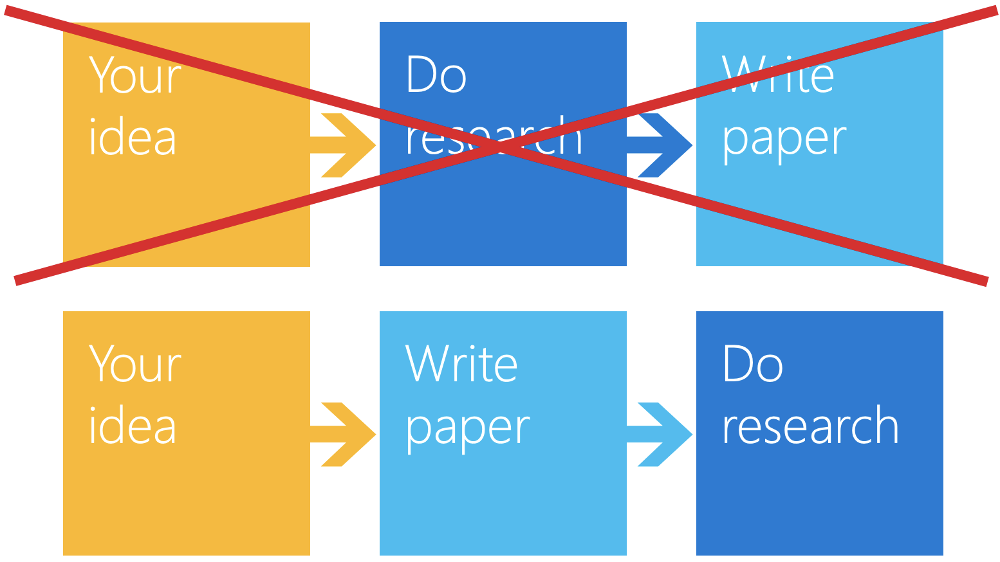

# How to Write Research Papers

I'm a Ph. D student working on robotics and deep learning. Like most researchers, I also need to publish research papers. Preparing research papers takes much effort and time. Sometimes it even gives pains. However, I realized that there are a bunch of materials on the web I can benefit from and started summarizing those materials. This document might contain disputable statements since it is for my personal retrieval. I welcome comments and collaboration. Please send me e-mails or pull requests.

## Key Things to Keep in Mind

### Write Now!


### Top Down
- Tell a story
  - Not what you did
  - Rather, new ideas or insights
- A lead sentence to set context for a paragraph

### Reader Centered
- Get to the message ASAP
- Visualize (figures) & summarize (tables)
- Present enough context & information
- Don't let readers work hard
  - be consise and clear
  - not too many equations or graphs or paragraphs
- Check what readers might (want/not want) and (know/not know)

### Take Time
- Reflect, write, review, and refine
- Take time to write less


## How to Write Actually

### Title

### Abstract

### Introduction

### Conclusion

#### Useful Templates for Introduction

## Userfule Tools
- Thesaurus: [Thesaurus](https://www.thesaurus.com/), [Onelook](https://www.onelook.com/thesaurus/)
- Grammar & Style: [Grammarly](https://app.grammarly.com/), [HemingwayApp](http://www.hemingwayapp.com/)

```
Give the example
```

## References

* Professor Kim's lecture note
* How to write a great research paper
* Top-10 tips for writing a paper
* Writing scientific papers
* The elements of style
